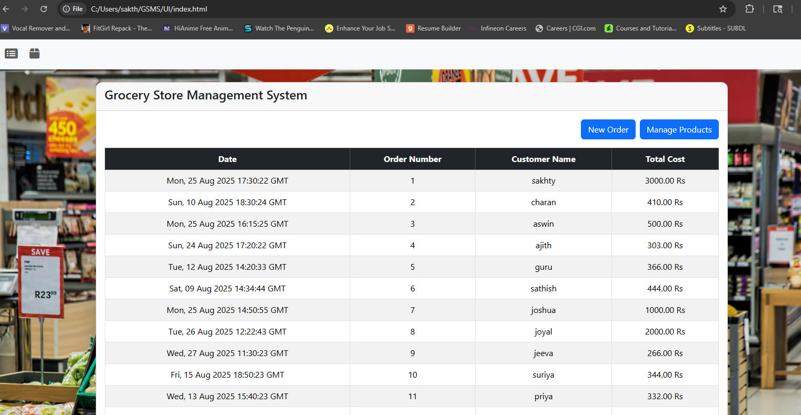
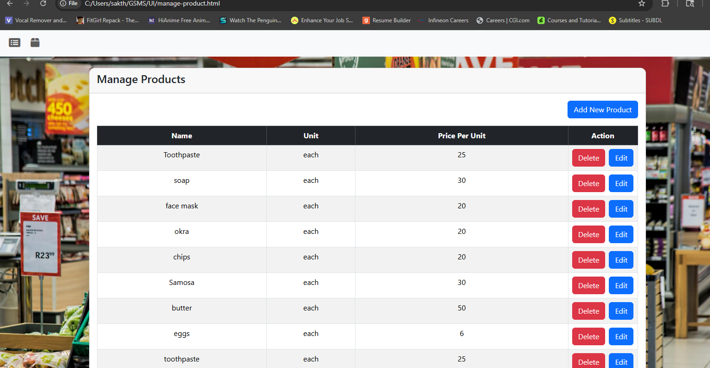
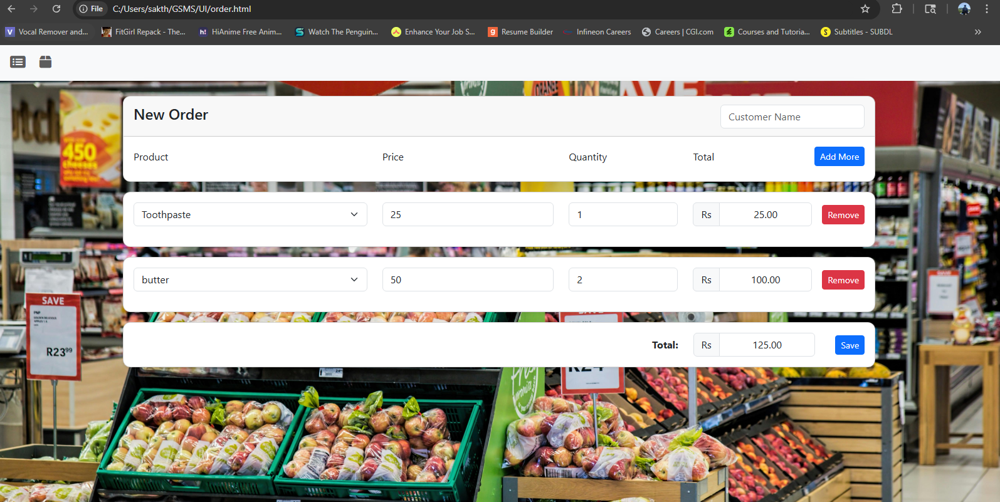

# GroceryWebapp-project
Full-stack grocery store management system built with Flask, MySQL, HTML, CSS, JavaScript, and AJAX — featuring CRUD operations, REST APIs, and responsive UI.

## 🚀 Screenshots

### 🏠 Home Page

### 📦 Manage Product

### 🧾 New Order

